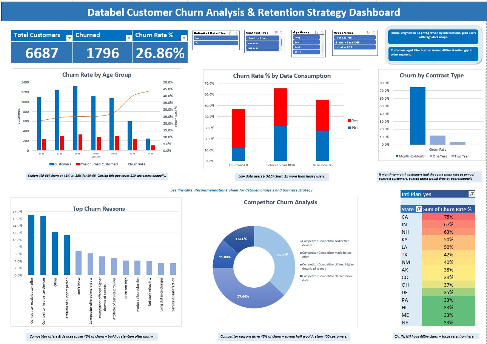

# 📊 Databel Customer Churn Insights & Retention Dashboard

    

---

## 🚀 Project Overview
This project presents an end-to-end customer churn analysis using the Databel dataset.  

The objective was to identify key drivers of churn, analyse customer behaviour, and provide actionable business recommendations to improve customer retention.

---

## 📚 Project Context
This project is based on a DataCamp customer churn analysis case study using the Databel dataset.

However, the scope was significantly extended beyond the original project by:

- Designing a fully interactive dashboard  
- Performing deeper exploratory data analysis  
- Identifying key behavioural and demographic churn drivers  
- Developing actionable business recommendations for customer retention  

The final deliverable reflects a real-world analytics workflow, from data exploration to strategic decision-making.

---

## 📊 Dashboard Preview

---

## 🎯 Business Problem
Customer churn poses a significant challenge for subscription-based businesses, impacting revenue and long-term growth.

This project aims to:
- Analyse churn patterns  
- Identify high-risk customer segments  
- Provide data-driven strategies to reduce churn  

---

## 📂 Dataset
The dataset includes:

- Customer demographics (age, location)  
- Account details (contract type, tenure)  
- Usage behaviour (data consumption)  
- Financial metrics (charges)  
- Churn status  

---

## 🔍 Analysis Performed

Key analytical areas explored:

- ✅ Customer segmentation (age, tenure, location)  
- ✅ Behavioural analysis (data usage patterns)  
- ✅ Contract-based churn analysis  
- ✅ Competitor-driven churn factors  
- ✅ Geographic churn distribution  

---

## 📈 Key Insights

- 📌 Month-to-month contracts have the highest churn rates  
- 📌 Customers with less than 12 months tenure are at highest risk  
- 📌 Senior customers show significantly higher churn  
- 📌 Low data usage strongly correlates with churn  
- 📌 Competitor offers account for ~45% of churn  

---

## 💡 Business Recommendations

- ✅ Introduce incentives for long-term contracts  
- ✅ Improve customer support and service quality  
- ✅ Target high-risk customer segments with retention campaigns  
- ✅ Proactively engage low-usage customers  
- ✅ Strengthen competitive pricing and device offerings  

---

## 🛠️ Tools & Technologies

- Microsoft Excel   
- Pivot Tables  
- Data Cleaning & Transformation  
- Data Visualisation (Dashboard Design)  

---

## 📊 Project Structure
Raw_Data → Data source
Analysis → Aggregated insights (pivot tables)
Dashboard → Visual analytics
Insights_Recommendations → Business insights & strategy

---

## 📊 Dashboard Highlights

The dashboard provides a consolidated view of customer churn patterns through:

- 📌 KPI overview (Total Customers, Churned Customers, Churn Rate)  
- 📌 Customer segmentation by age group and tenure  
- 📌 Behavioural analysis based on data usage patterns  
- 📌 Contract type analysis (month-to-month vs long-term)  
- 📌 Geographic distribution of churn across states  
- 📌 Churn drivers including competitor influence and service factors  

---

## 📌 Key Takeaway

This project demonstrates the ability to:

- Transform raw data into structured analytical insights  
- Develop interactive dashboards for business decision-making  
- Identify high-risk customer segments  
- Translate data findings into actionable retention strategies  

---

## 💼 Business Impact

Reducing churn by even a small margin (e.g. 5%) can significantly improve:

- Customer lifetime value  
- Revenue stability  
- Customer satisfaction and retention  

The insights generated in this analysis provide a foundation for data-driven interventions that can directly support business growth.

---

## 🙌 Acknowledgement

This project builds upon a DataCamp customer churn case study dataset.

The analysis was significantly extended through independent work, including additional data exploration, dashboard development, and strategic business recommendations to reflect a real-world analytics workflow.

---

## 📬 Contact

If you would like to discuss this project or collaborate:

-🔗 LinkedIn: [https://linkedin.com/in/amlovedayokoro]  
-🌐 Portfolio: [https://loveday-data-profile.vercel.app]
---

⭐ *Thank you for viewing this project!*
